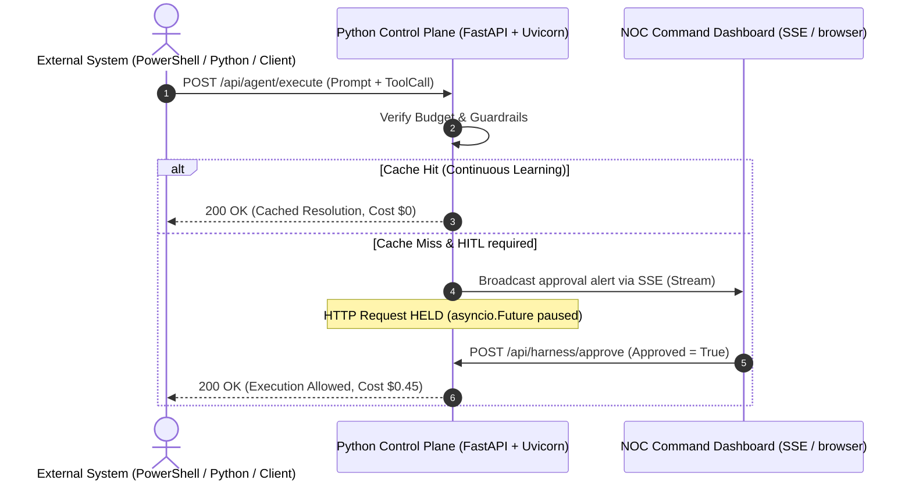

# Walkthrough - Incedo Agentic AI Control Plane (Python FastAPI Backend)

This document describes the architecture of the **Python-based Incedo Agentic AI Control Plane** and details how to verify the active REST API Gateway proxy and Human-in-the-Loop approval workflows.

---

## 1. System Architecture

The Incedo Control Plane acts as a real-time gateway sitting over agentic workflows. Instead of client-side mocks, the system uses a **Python (FastAPI)** backend that intercepts all incoming agent queries via a unified REST endpoint (`POST /api/agent/execute`).



### Components
1. **Control Plane Backend Gateway (`server.py`)**: Runs on `http://localhost:5174/` using `uvicorn`. Manages the agents registry, tools registry, active control flags, and budget metrics. Exposes Server-Sent Events (SSE) stream `/api/harness/stream` to broadcast trace events.
2. **Interactive NOC Dashboard (`index.html`, `app.js`, `style.css`)**: Connects to the SSE stream. Provides real-time SVG topology visualization, log streaming, budget configuration controls, and supervisor override buttons.

---

## 2. Running the Control Plane

You can start the Python control plane server using the existing Node dev command (which is mapped to run the Python server):
```bash
npm run dev
```
Alternatively, launch it directly:
```bash
python server.py
```
This starts uvicorn on port `5174`. Open **[http://localhost:5174/](http://localhost:5174/)** in your browser to load the dashboard.

---

## 3. Verification Steps & Commands

You can verify the Python gateway gatekeeper behaviors directly from your terminal.

### Case A: Verify Normal Execution (Immediate 200 OK)
Run a request that does not require human approval (e.g. Telemetry agent processing logs):
```powershell
Invoke-RestMethod -Uri "http://localhost:5174/api/agent/execute" `
  -Method Post `
  -ContentType "application/json" `
  -Body '{"agentId":"telemetry-agent", "prompt":"Process 1,200 router interface alarm logs"}'
```
**Expected Result**: Resolves immediately with `200 OK` showing `Claude 3.5 Sonnet` routing execution and a cost of `$0.01`.

---

### Case B: Verify Runway Loop Guardrail (Immediate 403 Forbidden)
Submit a query containing a runaway query pattern (e.g. "continuously poll"):
```powershell
Invoke-RestMethod -Uri "http://localhost:5174/api/agent/execute" `
  -Method Post `
  -ContentType "application/json" `
  -Body '{"agentId":"delphi-rca", "prompt":"continuously poll configurations and sync discrepancies"}'
```
**Expected Result**: Denied immediately by the control plane guardrails with a `403 Forbidden` response:
```json
{"error":"Guardrail Denied","message":"Request blocked by safety policy. Runaway loop signature detected."}
```
The node on the dashboard flashes **Red (Alert)** and a warning is printed to the live NOC console.

---

### Case C: Verify Human-in-the-Loop Hold & Release
Run an RCA query that invokes a write tool (`bgp_router_write`), which requires human supervisor authorization. 

Open a PowerShell window and run:
```powershell
# 1. Start the agent request in a background job (blocks and waits for approval)
$job = Start-Job -ScriptBlock { 
    Invoke-RestMethod -Uri "http://localhost:5174/api/agent/execute" `
      -Method Post `
      -ContentType "application/json" `
      -Body '{"agentId":"delphi-rca", "prompt":"Root cause analysis ticket #RCA-9082", "toolCall":{"name":"bgp_router_write","action":"Apply route loop AS-65001 filter"}}' 
}

# 2. Wait for it to register on the server, then fetch the active approval transaction ID
Start-Sleep -Seconds 3
$approvals = Invoke-RestMethod -Uri "http://localhost:5174/api/harness/approvals"
$txId = $approvals[0]
Write-Host "Active transaction ID on Control Plane: $txId"

# 3. Approve the transaction (simulates clicking 'Approve' on the dashboard)
Invoke-RestMethod -Uri "http://localhost:5174/api/harness/approve" `
  -Method Post `
  -ContentType "application/json" `
  -Body "{`"txId`":`"$txId`", `"approved`":true}"

# 4. Receive and display the released execution response
Receive-Job -Job $job -Wait
```
**Expected Result**:
- Step 1 starts a background job that hangs because the write command is suspended.
- Step 2 gets the active `txId` from the backend queue.
- Step 3 releases the hold.
- Step 4 completes, returning the final agent resolution payload with the total execution cost.

---

### Case D: Verify Continuous Learning Cache Hit (Immediate 200 OK)
Run the exact same RCA query again. Since the resolution was successfully cached in the shared index database, the request should bypass the model generation entirely:
```powershell
Invoke-RestMethod -Uri "http://localhost:5174/api/agent/execute" `
  -Method Post `
  -ContentType "application/json" `
  -Body '{"agentId":"delphi-rca", "prompt":"Root cause analysis ticket #RCA-9082"}'
```
**Expected Result**: Bypasses LLM generation instantly with a cost of `$0.00` and displays `source: cache_retrieval`. The dashboard animates a packet flowing from `Delphi RCA` to the `Knowledge AI Engine` node.

---

## 4. Multi-Page SaaS Views & UI Features

The new control plane frontend is structured as a detailed, multi-view enterprise Command Center:

### A. Sidebar Navigation Routing
- Click links on the left sidebar: **Agentic Mesh Topology**, **Rules & Policies**, **LangSmith Trace Explorer**, **FinOps & Evals**, and **Prompt Playground**.
- Swapping panels updates the viewport title and swaps active views smoothly with subtle animations.

### B. Sliding Agent Drawer
- Go to **Agentic Mesh Topology**. Click any agent node (e.g. `Delphi RCA` or `Telemetry`).
- The right-hand **Agent Configurations** drawer opens, loading the agent's active model routing, authorized tools registry checklist, runaway safety thresholds, and custom prompt templates.
- Changes to selections instantly save to the backend.

### C. Contextual Targeting Rules Registry
- Go to **Rules & Policies**.
- Use the **Contextual Targeting Rules Registry** policy builder card to add, edit, or delete routing overrides based on request tags (e.g., matching region or user roles to enforce reasoning model routing or supervisor approval holds).

### D. Telemetric Span Trees & Judges
- Go to **LangSmith Trace Explorer**.
- Select any completed run from the recent runs table to expand its **Runtime Span Tree & Inspector**.
- Hierarchical nested span nodes are rendered recursively with collapse indicators showing individual step latency and execution success/failed states.
- Inspect the **Automated Output Judges** grades for real-time safety scanning, schema compliance, and cost efficiency.

### E. Sandbox Playground & Diffs
- Go to **Prompt Playground**.
- Check the Monaco-style side-by-side prompt diff pane highlighting text insertions (`+` green) and deletions (`-` red) between stable and candidate prompt templates.
- Write queries in the **Live Sandbox Playground Console** and execute them directly against the active agent to stream real-time logs and inspect live evaluation grades.

---

## 5. Multi-Agent Orchestration & Routing

The system now registers three new agents and supports two multi-agent orchestrated workflows:

### A. Case E: Verify Supervisor Orchestration (Five-Agent Mesh Outage RCA)
This flow coordinates the **Supervisor Orchestrator** to run a series of sub-agent jobs:
1. **Telemetry Fusion Agent** correlates the alarm streams.
2. **Knowledge AI Engine** performs historical cache indexing.
3. **Delphi RCA Agent** attempts to write BGP configurations (triggers **Human-in-the-Loop** approval hold).
4. **SecOps Compliance Agent** reviews configuration diffs for compliance.
5. **SMTP Alert Service** dispatches ops team alerts.

**Testing via Prompt Playground**:
1. Select the **Multi-Agent Orchestration (Supervisor)** scenario in the Prompt Playground.
2. Click **Run Sandbox Query**.
3. Go to the **Agentic Mesh Topology** screen to watch packet flows animate across nodes in real-time.
4. When the approval overlay appears, click **Approve & Write**.
5. Once complete, inspect the **LangSmith Trace Explorer** recent runs table. The trace shows a nested tree structure (e.g. Telemetry run under root, BGP write tool under Delphi run) and charges a consolidated cost of **$0.91**.

### B. Case F: Verify BizOps Multi-Agent Sync (Three-Agent Ledger Reconciliation)
This flow coordinates the **BizOps Order Mesh** to run:
1. **Billing Reconciliation Agent** (to reconcile ledger records).
2. **Knowledge AI Engine** (to query historical exceptions).
3. **Database Query** tool (to retrieve SQL config values).

**Testing via Prompt Playground**:
1. Select the **BizOps Multi-Agent Sync** scenario in the Prompt Playground.
2. Click **Run Sandbox Query**.
3. Watch packets animate from BizOps to Billing Sync and Knowledge AI on the SVG canvas.
4. Check the trace in **LangSmith Trace Explorer** to view the nested spans tree. The total cost is **$0.01**.

### C. Case G: Screenshot & Presentation Controls (Theme and Font Scale Toggles)
To support taking high-contrast, highly-legible screenshots for reviews and slide decks:
- **Theme Toggle**: In the viewport header, click the **☀️ Light Mode** button. This instantly overrides all CSS custom variables with a high-contrast premium light theme palette (white panel backgrounds, dark text, clean borders, and pastel node highlights). Click **Dark Mode** to toggle back.
- **Text Scaling**: Use the text-scale select dropdown next to the theme button to instantly scale up font sizes globally across all cards, lists, side drawer details, log consoles, and SVG canvas elements (options: *A Normal*, *A+ Large*, and *A++ X-Large*).
- **State Persistence**: Selected theme and scale selections automatically persist in browser `localStorage` across page refreshes.

---

## 6. Render Cloud Deployment

To deploy this control plane prototype permanently to the cloud:
1. Create a repository on GitHub (e.g., `agentic-control-plane`) and push all project files, including `render.yaml` and the `Dockerfile`.
2. Sign in to [Render](https://render.com/).
3. Click **New +** (top right) and select **Blueprint**.
4. Connect the GitHub repository. Render will automatically read the `render.yaml` file to configuration-configure the web service.
5. Click **Apply** to build the Docker image and deploy.

